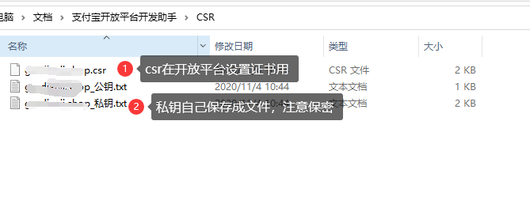

# 移动支付 Spring Boot 组件
提供聚合支付能力。

## 支持类型

- [x] **微信支付V3** 全量支持。
- [x] **支付宝**  提供所有实现，具体以签约项目为准。 
## 进度
- 微信支付营销-代金券 `WechatMarketingFavorApi` 100%
- 微信支付 支付功能 `WechatPayApi` app预支付

## 采用技术
- Spring
- Jackson
- Ali-pay-sdk
## 使用方法
### 集成
以**Spring Boot Starter**的形式集成到项目中。

```xml
      <dependency>
            <groupId>cn.felord</groupId>
            <artifactId>payment-spring-boot-starter</artifactId>
            <version>1.0.0.RELEASE</version>
      </dependency>
```
### 配置
#### 微信支付
在Spring Boot项目中的`application.yaml`中配置`wechat.pay`相关参数。
```yaml
wechat:
  pay:
    v3:
#  应用appId 必填
      app-id: xxxxxxxx
#  api 密钥 必填
      app-secret: xxxxxxxxxxx
#  api v3 密钥 必填
      app-v3-secret: xxxxxxxx
#  微信支付商户号 必填
      mch-id: xxxxxxx
#  合作商 选填
      partner-key:
#  商户服务器域名 用于回调  需要放开回调接口的安全策略 必填
      domain: https://xxxx.xxx.com
#  商户 api 证书 必填
      cert-path: apiclient_cert.p12
#  微信服务号 优惠券必须
      mp:
        app-id: xxxxxxxxx
        app-secret: xxxxxxxxxxxxxxxxxxx
```
然后启用`@EnableWechatPay`注解：
```java
@EnableMobilePay
@Configuration
public class PayConfig {
}
```
> 请注意：只有`wechat.pay.v3.app-id`设置了有效值才能启用下面的API。
##### API使用 
微信支付V3开放接口引入：
```java
    @Autowired
    WechatPayApi wechatPayV3Api;    
    @Autowired
    WechatMarketingFavorApi  wechatMarketingFavorApi; 
```
###### V3
例如V3 查询商户下的优惠券

```java
     // 查询商户下的优惠券
     @Test
     public void v3MchStocks() {
         StocksQueryParams params = new StocksQueryParams();
         params.setOffset(0);
         params.setLimit(10);
         WechatResponseEntity<ObjectNode> objectNodeWechatResponseEntity = wechatMarketingFavorApi.queryStocksByMch(params);
         System.out.println("objectNodeWechatResponseEntity = " + objectNodeWechatResponseEntity);
     }
```
 

#### 支付宝
##### 使用须知
请注意因为未来**SHA1withRSA**将被淘汰，因此采用最新的**SHA256withRSA**证书，旧的模式将不提供支持。步骤如下：

1.使用支付宝开发助手申请CSR文件


申请成功后看文件说明：



2.上传CSR设置证书

 

上传成功后需要下载证书，和配置的对应关系为：


3. 其它开发平台商户平台的配置，参考支付宝接入文档。
##### 项目开发配置
在Spring Boot项目中的`application.yaml`中配置`ali.pay`相关参数。
```yaml
ali:
  pay:
    v1:
# 可以替换为沙箱
      server-url: https://openapi.alipaydev.com/gateway.do
# 蚂蚁开放平台申请并认证的应用appId
      app-id: 2016102700769563
      app-private-key-path: META-INF/app_rsa
      alipay-public-cert-path: META-INF/alipayCertPublicKey_RSA2.crt
      alipay-root-cert-path: META-INF/alipayRootCert.crt
      app-cert-public-key-path: META-INF/appCertPublicKey_2016102700769563.crt
      charset: utf-8
      format: json
      sign-type: RSA2
```
> 请注意：只有`ali.pay.v1.app-id`设置了有效值才能启用下面的API。
##### API的使用

引入接口：
```java
    @Autowired
    AlipayClient alipayClient;
```
调用，以现金红包为例：
```java
    @SneakyThrows
    public void campaignCash() {
        AlipayMarketingCampaignCashCreateRequest request = new AlipayMarketingCampaignCashCreateRequest();
        request.setBizContent("{" +
                "\"coupon_name\":\"XXX周年庆红包\"," +
                "\"prize_type\":\"random\"," +
                "\"total_money\":\"10000.00\"," +
                "\"total_num\":\"1000\"," +
                "\"prize_msg\":\"XXX送您大红包\"," +
                "\"start_time\":\"2020-11-02 22:48:30\"," +
                "\"end_time\":\"2020-12-01 22:48:30\"," +
                "\"merchant_link\":\"http://www.weibo.com\"," +
                "\"send_freqency\":\"D3|L10\"" +
                "  }");

        AlipayMarketingCampaignCashCreateResponse execute = alipayClient.certificateExecute(request);

        System.out.println("execute = " + execute.getBody());
    }
```
打印响应体：
```json
{"alipay_marketing_campaign_cash_create_response":{"code":"40004","msg":"Business Failed","sub_code":"isv.UNKNOW_SYSTEM_ERROR","sub_msg":"系统繁忙，请稍后再试"},"alipay_cert_sn":"e65893247c520d9d46db3000158505ee","sign":"M7gyi6ZwnRoHmdzd1IIxLc+XEE1pCx6ptOyQP4aRGMc01bJebNL7PbMpfU7TcB75KHmk3Oor2fYZfVEB7+5gxV9YwMuW3QtZbyACw3Gzt7wz4D1YCXkQD9PRvSsgw8xgNL+WnZxEI2yFdSp47Mc/Um73M101zFeo2dYKYXyVRdsGxnipY8fZs0JaXlX5OoROfHDcbvzBDjQyernspIoFoNiAwpaBwyQcEzh8V34ca4Rep/LSyI4N4VtU0n2nq3dO0Jor36n0o4j0QobWSE3c8StkVjbdP5XJB+adE51MUmh7xDdixQXE2fTRKw5wYlBO9O3bpF/uw78hWW/y3JwG9Q=="}
```
## CHANGELOG
### 1.0.0.RELEASE

- 支持微信支付V3、支付宝支付