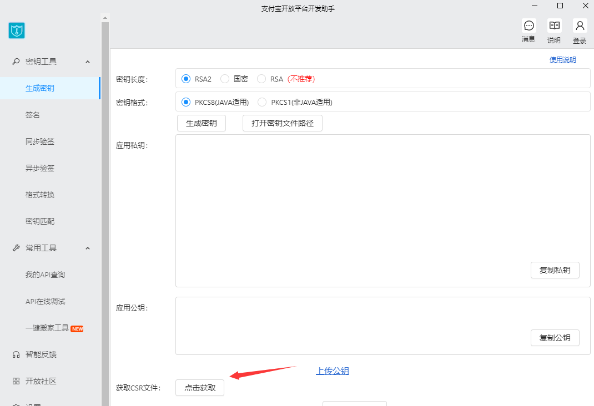
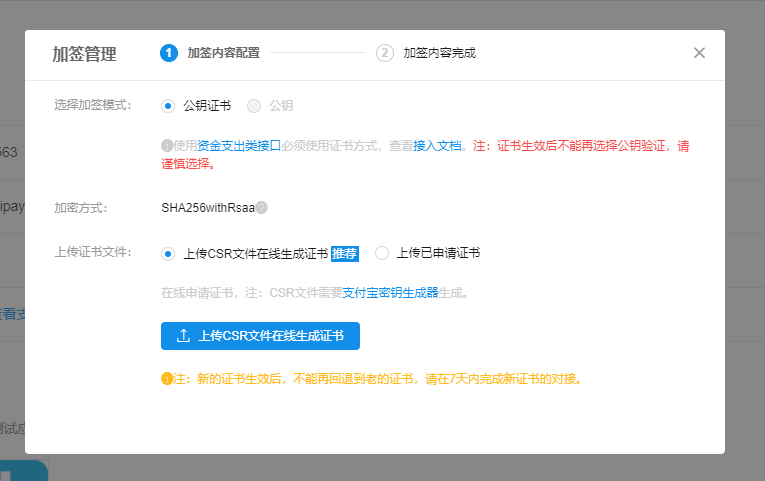
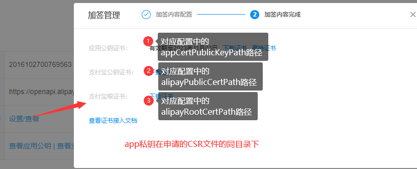

## 微信
### 微信支付技术分享
- [Java中的微信支付（1）：API V3版本签名详解](https://mp.weixin.qq.com/s/iiTCr57FgbAb6s0P0hT-9Q)
- [Java中的微信支付（2）：API V3 微信平台证书的获取与刷新](https://mp.weixin.qq.com/s/O_YcnIRcl2MltElBupm3Hg)
- [Java中的微信支付（3）：API V3对微信服务器响应进行签名验证](https://mp.weixin.qq.com/s/cb2eTTRjHifNYUGpQETMCQ)
### 微信支付V3中的坑
#### 代金券
- 代金券制券后不能修改，所以一定要注意
- 已激活的代金券批次被停用后不影响该批次已发放代金券的核销 
- 代金券激活券和制券要有一定的间隔时间，官方说是1分钟
- 发券不需要靠微信服务号，官方的描述是错误的，有一个支持微信登录的appid就行了
- 制券 返回`403`，报文`{"code":"REQUEST_BLOCKED","message":"活动未开始或已结束\n"}`检查规则是否符合：
 ```
   1.stock_name：最多可填写9个字
   2.max_coupons_per_user：单天发放个数上限不能为0
   3. coupon_amount：10<=coupon_amount<=100000
   4.available_time_after_receive：可用时间：相对时间，按分钟设置，是否1min<=分钟范围<=1440min
   5.transaction_minimum校验规则：
     a、使用门槛-券面额>=0.01（门槛要大于面额）
     b、0.1元<=门槛<=100000
   6.stock_type：目前只支持NORMAL
   7.out_request_no：校验规则：不可以重复
   8.活动时间不可以大于90天 
 ```
#### 微信支付分
- 微信支付分`service_id`相关
```
 1. 在微信支付分功能申请成功后，联系运营那边配置 service_id。
 2. service_id 是微信支付商户属性
 3. 一个 service_id 可以对应多个 mchid
 4. 更多的就要联系微信支付BD了
```

!> 不要过分相信微信文档，微信文档不一定是真的，要问就问他们客服

## 支付宝

### 证书

请注意因为未来**SHA1withRSA**将被淘汰，因此采用最新的**SHA256withRSA**证书，旧的模式将不提供支持。步骤如下：

1.使用支付宝开发助手申请CSR文件


申请成功后看文件说明：


2.上传CSR设置证书



上传成功后需要下载证书，和配置的对应关系为：



